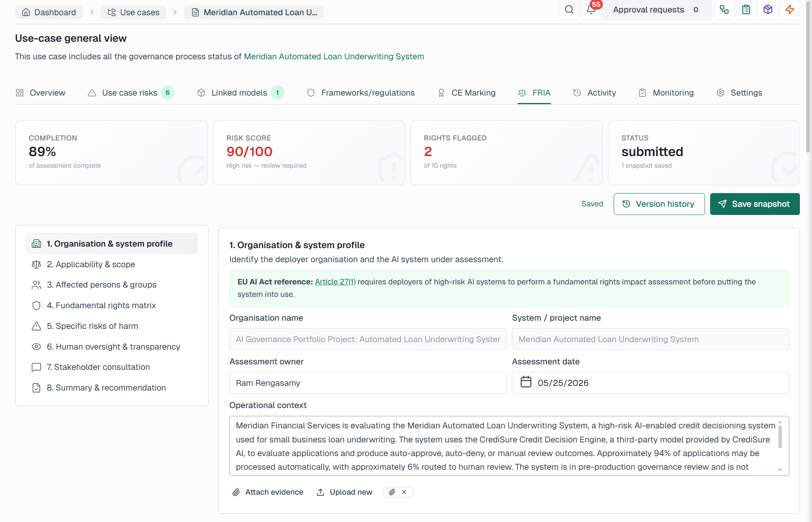

# 02 — Use Case Registration (EU AI Act)

**Use Case:** Meridian Automated Loan Underwriting System  
**Classification:** High Risk  
**Applicable Regulation:** EU AI Act

## Summary

Registered the Meridian Automated Loan Underwriting System as a high-risk AI use case under the EU AI Act.

| Field | Value |
|---|---|
| **Use Case** | Meridian Automated Loan Underwriting System |
| **AI Risk Classification** | High Risk |
| **Role** | Deployer |
| **Target Industry** | Financial Services / Small Business Lending |
| **Approval Workflow** | High-Risk AI Use Case Approval Workflow |
| **Applicable Regulation** | EU AI Act |

The system qualifies as high-risk because it affects access to credit and may create financial, legal, fairness, explainability, and consumer harm risks.

*VerifyWise screenshot to be added.*

### System Interface Capture

