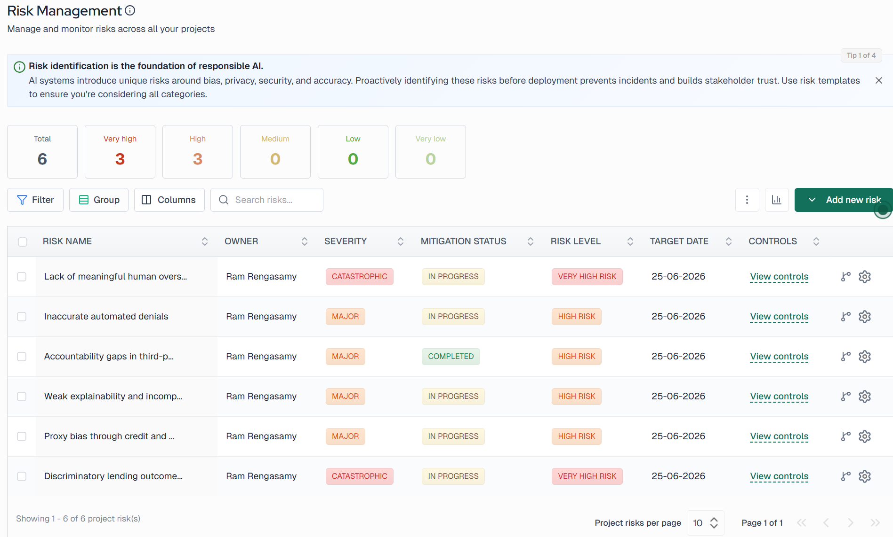

# 05 — Risk Register

**System:** Meridian Automated Loan Underwriting System  
**Number of Risks:** 6

## Risk Summary

| # | Risk | Source | Inherent Level | Residual Level |
|---|---|---|---|---|
| 1 | Discriminatory lending outcomes | IBM AI Risk DB | Catastrophic / Possible | Medium-High |
| 2 | Proxy bias through credit and business variables | IBM AI Risk DB | Major / Likely | Medium |
| 3 | Weak explainability and incomplete reason codes | IBM AI Risk DB | Major / Possible | Medium |
| 4 | Accountability gaps in third-party AI deployment | MIT AI Risk Repo | Major / Possible | Low |
| 5 | Inaccurate automated denials | Custom | Major / Possible | Medium |
| 6 | Lack of meaningful human oversight | Custom | Catastrophic / Almost Certain | High |

## Critical Risk: Risk 6

Risk 6 — lack of meaningful human oversight — carries the highest inherent rating (Almost Certain / Catastrophic) because the 94% automation rate leaves minimal space for human review of most lending decisions.

*VerifyWise screenshot to be added.*

### System Interface Capture

