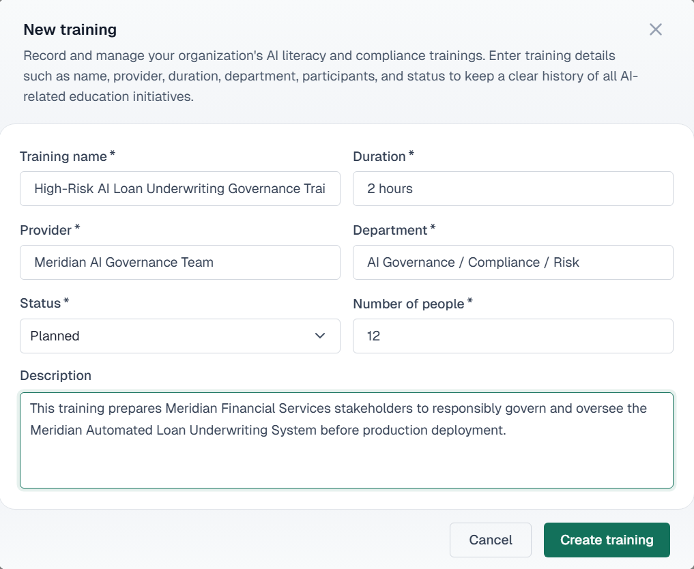

# 06 — AI Training Registry

**Training Program:** High-Risk AI Loan Underwriting Governance Training  
**Status:** Planned

## Summary

| Field | Value |
|---|---|
| **Training Name** | High-Risk AI Loan Underwriting Governance Training |
| **Duration** | 2 hours |
| **Provider** | Meridian AI Governance Team |
| **Department** | AI Governance / Compliance / Risk |
| **Status** | Planned |
| **Number of People** | 12 |

## Stakeholders

AI Governance Lead, Compliance Reviewer, Model Risk Reviewer, Credit Risk Owner, Vendor Risk Owner, Security/Privacy Reviewer, Underwriting Manager, 3 Human Underwriters, Executive Approver, and Legal/Risk Advisor.

*VerifyWise screenshot to be added.*

### System Interface Capture

