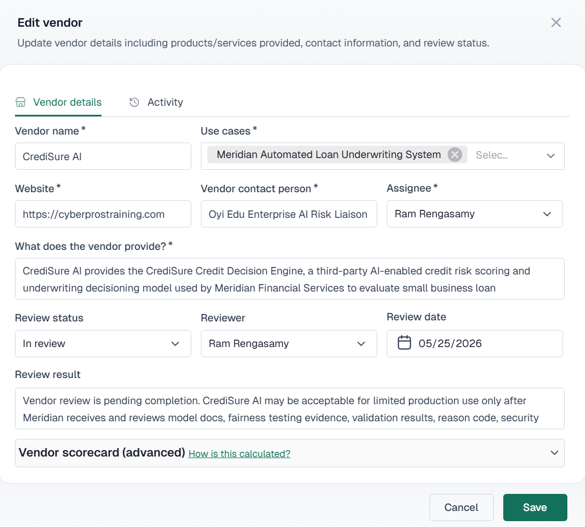

# #08 – Third-Party Vendor & Model Review

**Use Case:** Meridian Automated Loan Underwriting System  
**Vendor Evaluated:** CrediSure AI (Credit Decision Engine v2.3)  
**Governance Status:** **Conditional Approval Only**

## Summary

This evaluation reviews the third-party model dependency risks, operational limitations, and compliance evidence requirements under core AI governance standards.

---

## Core Limitations & Risk Identification

* **Opaque Architecture:** The model operates as a "black box". Meridian lacks direct visibility into the underlying neural network architecture, specific feature weights, and exact training boundaries.
* **Explainability Gaps:** The system only outputs high-level, generic credit denial codes. These codes are insufficient to satisfy fair lending transparency mandates and consumer adverse action notice requirements.
* **Data Dependency:** Performance metrics, bias evaluations, and drift baselines are entirely self-reported by the vendor without independent validation capabilities.

---

## Governance Requirements & Compliance Conditions

To transition this vendor from conditional to full production approval, the following evidence must be provided and reviewed by the Risk Committee:
1. **Comprehensive Documentation:** Supply the formal Model Card, comprehensive technical validation reports, and data privacy governance terms.
2. **Fairness Testing Proof:** Provide historical data demonstrating bias assessments across protected demographic attributes.
3. **Independent Verification:** Establish a mechanism to audit and validate the vendor's automated explanation outputs against actual credit application attributes.

---

### System Interface Capture
