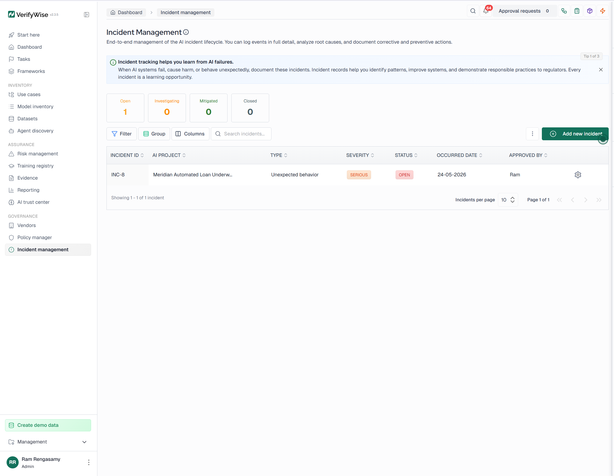

# #10 – Human Oversight & Appeal Procedure

**Use Case:** Meridian Automated Loan Underwriting System  
**Oversight Framework:** Human-in-the-Loop (HITL) Controls  
**Target Execution Profile:** 94% Automated Execution / 6% Manual Escalation

## Summary

This procedure outlines the automated decision boundaries, manual override thresholds, and consumer appeal pathways designed to counteract automation bias and maintain robust accountability.

---

## Mandatory Human Review Triggers

The underwriting system is explicitly restricted from making a final automated decision if any of the following conditions are met:
* **Marginal Decision Zone:** The applicant's credit score or risk profile falls within the designated ±5% threshold of the automated cutoff line.
* **Data Anomaly / Thin Files:** The applicant has an incomplete credit history or highly volatile cash-flow telemetry that causes low model confidence.
* **System Flag:** High-value loan applications exceeding the automated approval cap set by the Credit Committee.

---

## Override Governance & Escalation

* **Authority Limits:** Loan officers have the authority to review and manually override an AI recommendation, but all overrides must be accompanied by a documented business justification.
* **Dual Authorization:** Any override involving an application exceeding \$250,000 requires secondary sign-off from the Underwriting Manager.
* **Applicant Appeal Path:** Applicants denied credit via the automated system have the right to request a formal manual reconsideration. Appeals must be reviewed by a human underwriter within 5 business days using independent financial data.

---

### System Interface Capture
