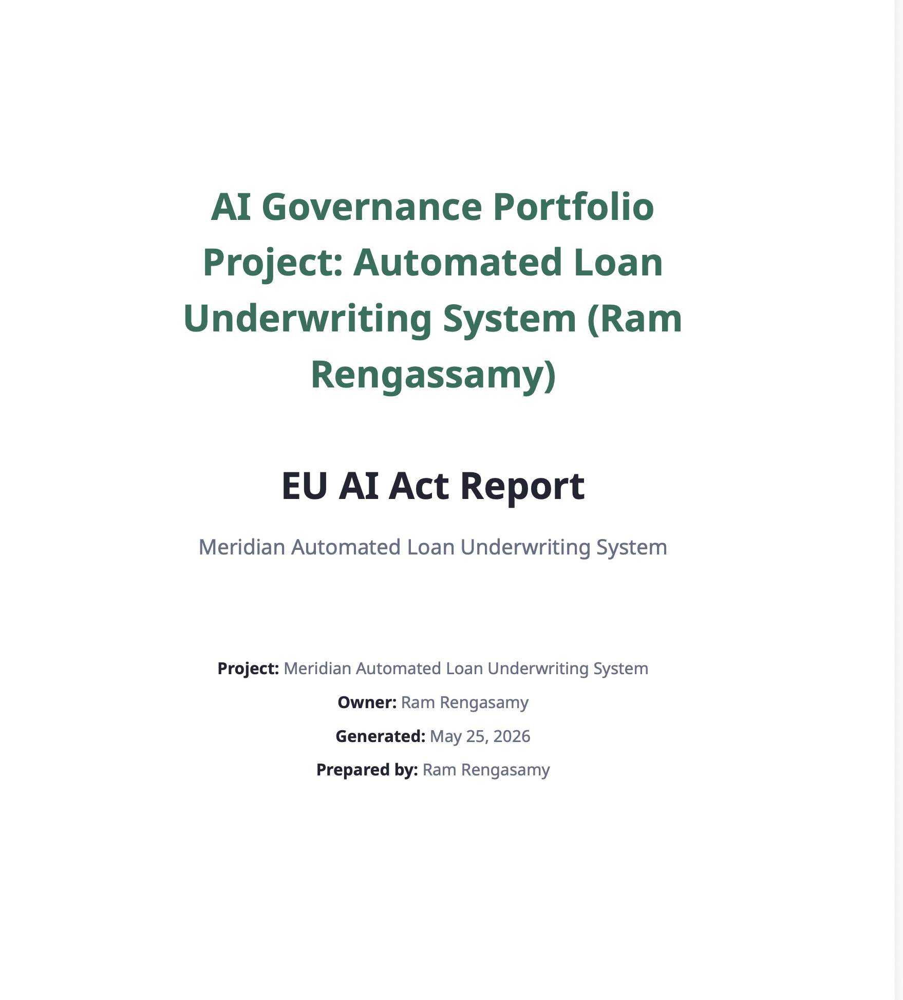

# #14 – Production Readiness Decision Memo

**To:** Meridian Financial Services Executive Credit Committee  
**From:** AI Governance Lead  
**Date:** May 2026  
**Subject:** Deployment Readiness Review – Meridian Automated Loan Underwriting System  
**Final Recommendation:** **Proceed with Conditions (Do Not Approve Unrestricted Deployment)**

## Summary

This formal executive memo evaluates the final compliance posture, pre-launch gaps, and specific enforcement conditions required for the automated loan underwriting system before pilot deployment.

---

## Key Findings & Assessment Gaps

The Meridian Automated Loan Underwriting System provides significant operational speed advantages, but it introduces critical regulatory, fairness, and transparency exposures that must be resolved prior to launch:
* **Explainability Deficit:** The system cannot currently provide legally compliant denial reasons, exposing the firm to fair lending compliance failures.
* **Oversight Gaps:** The 94% automation rate lacks documented human override guardrails and formalized applicant appeal tracks.
* **Vendor Risk:** Core model technical documentation and independent bias testing results have not yet been delivered by the vendor.

---

## Mandatory Pre-Deployment Conditions

The system may only launch under a limited, conditionally monitored pilot once the following controls are fully implemented and verified:
1. **Validate Denial Codes:** Ensure all automated denial outputs are successfully mapped to clear, compliant explanation codes.
2. **Formalize HITL Rules:** Fully configure and test the human review triggers, override limits, and 5-day appeal processing workflows.
3. **Complete Stakeholder Training:** Execute the planned 2-hour AI governance training registry for all 12 core operational stakeholders.

---

### System Interface Capture

📄 [Download the full Production Readiness Report PDF](./AI_Governance_Portfoilio_Report_Use_case-RR.pdf)