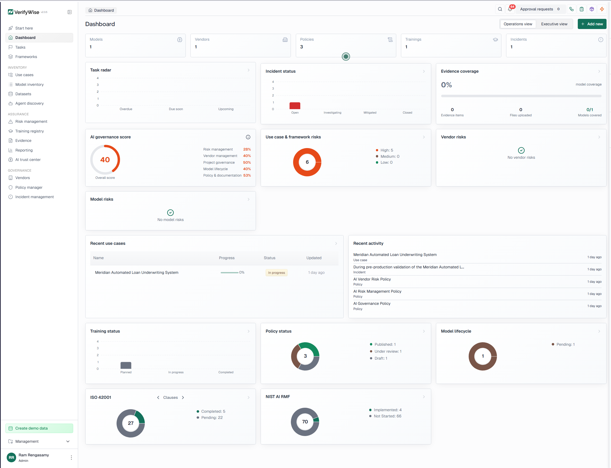

# AI Governance Portfolio

## Automated Loan Underwriting System — Meridian Financial Services

**Practitioner:** Ramamurthy R  
**GitHub:** [github.com/ram0516](https://github.com/ram0516)  
**Platform:** [VerifyWise](https://cyberpros.verifywise.ai/)  
**Training Platform:** [Cyberpros Training](https://cyberprostraining.com/)  
**Frameworks Applied:** EU AI Act · NIST AI RMF · ISO/IEC 42001  
**Status:** Completed — May 2026

---

## VerifyWise Dashboard

> *VerifyWise governance dashboard showing the Meridian Automated Loan Underwriting System assessment — use case registration, risk register, model inventory, vendor record, evidence pack, and policy library.*



---

## Overview

This portfolio documents a complete AI governance assessment for a high-risk, 94% automated loan underwriting system at Meridian Financial Services, a fictional mid-sized financial services company. The work was completed using VerifyWise, an AI governance and compliance management platform.

The central governance question this project answers:
> **Should Meridian Financial Services approve production deployment of a 94% automated AI loan underwriting system?**

The project covers the full governance lifecycle — from use case registration and risk identification through vendor review, policy creation, evidence documentation, and deployment readiness assessment.

---

## Business Context

Meridian Financial Services offers small business loans, working capital loans, lines of credit, equipment financing, and merchant financing products. Under pressure to compete with faster fintech lenders, Meridian piloted an AI-powered underwriting system called the **Meridian Automated Loan Underwriting System**, powered by a third-party model from **CrediSure AI** (CrediSure Credit Decision Engine v2.3).

The system produces three outcomes:

- **Auto-approve**
- **Auto-deny**
- **Route to manual review**

Approximately **94% of applications are processed automatically**. Only 6% reach a human underwriter. This automation level is the central governance concern driving the entire assessment.

---

## Repository Structure

```
├── README.md                          ← This file
├── 01-framework/                      ← Organizational governance framework
├── 02-use-case/                       ← Use case registration and EU AI Act classification
├── 03-model-inventory/                ← Model inventory record (CrediSure Credit Decision Engine)
├── 04-dataset/                        ← Dataset record (Small Business Loan Underwriting Dataset)
├── 05-risk-register/                  ← Six required risks with mitigations and residual assessments
├── 06-training-registry/              ← AI governance training record
├── 07-evidence-documents/             ← Five governance evidence documents
├── 08-vendor-management/              ← CrediSure AI vendor record
├── 09-policy-manager/                 ← Three organizational AI policies
├── 10-incident-management/            ← Pre-production incident record
├── 11-iso-42001/                      ← ISO 42001 Clauses and Annexes assessment
├── 12-nist-ai-rmf/                    ← NIST AI RMF controls assessment
├── 13-eu-ai-act/                      ← EU AI Act requirements, CE Marking, and FRIA
├── 14-portfolio-report/               ← Generated VerifyWise portfolio report (PDF)
└── screenshots/                       ← VerifyWise platform screenshots
```

---
### Portfolio Artifacts

| Artifact | Purpose | Link |
| :--- | :--- | :--- |
| **AI System Profile & Intake Record** | Documents system purpose, users, affected groups, data, vendor, and risk classification. | [View Artifact](./02-use-case/1.AI_Governance_Intake_Record.docx) |
| **AI Risk Register & Mitigation Summary** | Documents key AI risks, severity, controls, residual risk, and recommendations. | [View Artifact](./05-risk-register/3.AI_Risk_Register_Mitigation_Summary.docx) |
| **Human Oversight & Appeal Procedure** | Defines human review triggers, override authority, escalation, and applicant appeal process. | [View Artifact](./10-incident-management/4.Human_Oversight_Appeal_Procedure.docx) |
| **Third-Party Vendor & Model Review** | Evaluates CrediSure AI vendor risk, model limitations, and required evidence. | [View Artifact](./08-vendor-management/2.Vendor_Model_Governance_Review.docx) |
| **Production Readiness Decision Memo** | Provides final executive recommendation and conditional approval terms. | [View Artifact](./14-portfolio-report/5.AI-Governance-Portfolio-Project-Automated-Loan-Underwriting-System-Decision-Memo.docx) |
| **Underwriting Dataset Record** | Baseline dataset used for evaluating fairness, bias, and technical model telemetry. | [View Dataset](./04-dataset/Small_business_loan_underwriting_dataset.csv) |


---

## Governance Work Completed

### Step 1 — Organizational Framework

Created an organizational-level AI governance framework in VerifyWise to track the governance assessment.

| Field | Value |
|---|---|
| **Title** | AI Governance Framework Assessment (Loan Underwriting System) |
| **Geography** | Global |
| **Status** | In Progress |
| **Applicable Regulations** | ISO/IEC 42001, NIST AI RMF |
| **Goal** | Evaluate whether Meridian has the governance structure, risk management process, controls, evidence, and oversight needed to support responsible deployment |

📁 [Framework details →](./01-framework/README.md)

---

### Step 2 — Use Case Registration (EU AI Act)

Registered the Meridian Automated Loan Underwriting System as a high-risk AI use case under the EU AI Act.

| Field | Value |
|---|---|
| **Use Case** | Meridian Automated Loan Underwriting System |
| **AI Risk Classification** | High Risk |
| **Role** | Deployer |
| **Target Industry** | Financial Services / Small Business Lending |
| **Approval Workflow** | High-Risk AI Use Case Approval Workflow |
| **Applicable Regulation** | EU AI Act |

The system qualifies as high-risk because it affects access to credit and may create financial, legal, fairness, explainability, and consumer harm risks.

📁 [Use case details →](./02-use-case/README.md)

---

### Step 3 — Model Inventory

Documented the third-party AI model powering the underwriting system.

| Field | Value |
|---|---|
| **Provider** | CrediSure AI |
| **Model** | CrediSure Credit Decision Engine |
| **Version** | 2.3 |
| **Status** | Pending |
| **Hosting** | CrediSure AI Cloud |
| **Capabilities** | Recommendation, Prediction, Scoring, Risk assessment, Anomaly detection, Summarization |

Key limitation noted: Meridian does not have full visibility into training data, model architecture, feature weighting, or all validation results. Explainability is limited to vendor-provided reason codes.

📁 [Model inventory details →](./03-model-inventory/README.md)

---

### Step 4 — Dataset Record

Registered the dataset used to train and operate the underwriting model.

| Field | Value |
|---|---|
| **Dataset** | Small Business Loan Underwriting Dataset |
| **Version** | 1.0 |
| **Classification** | Confidential |
| **Type** | Training |
| **Contains PII** | Yes |
| **Status** | Draft |

Known biases documented: potential proxy bias through geography, industry classification, business age, credit history, thin credit files, cash-flow volatility, and historical repayment patterns.

📁 [Dataset details →](./04-dataset/README.md)

---

### Step 5 — Risk Register

Identified and assessed six governance risks for the system. Risks were sourced from the IBM AI Risk Database, MIT AI Risk Repository, and created as custom risks.

| # | Risk | Source | Inherent Level | Residual Level |
|---|---|---|---|---|
| 1 | Discriminatory lending outcomes | IBM AI Risk DB | Catastrophic / Possible | Medium-High |
| 2 | Proxy bias through credit and business variables | IBM AI Risk DB | Major / Likely | Medium |
| 3 | Weak explainability and incomplete reason codes | IBM AI Risk DB | Major / Possible | Medium |
| 4 | Accountability gaps in third-party AI deployment | MIT AI Risk Repo | Major / Possible | Low |
| 5 | Inaccurate automated denials | Custom | Major / Possible | Medium |
| 6 | Lack of meaningful human oversight | Custom | Catastrophic / Almost Certain | High |

Risk 6 — lack of meaningful human oversight — carries the highest inherent rating (Almost Certain / Catastrophic) because the 94% automation rate leaves minimal space for human review of most lending decisions.

📁 [Risk register details →](./05-risk-register/README.md)

---

### Step 6 — AI Training Registry

Documented planned governance training for the 12 stakeholders responsible for operating and overseeing the system.

| Field | Value |
|---|---|
| **Training Name** | High-Risk AI Loan Underwriting Governance Training |
| **Duration** | 2 hours |
| **Provider** | Meridian AI Governance Team |
| **Department** | AI Governance / Compliance / Risk |
| **Status** | Planned |
| **Number of People** | 12 |

Stakeholders include: AI Governance Lead, Compliance Reviewer, Model Risk Reviewer, Credit Risk Owner, Vendor Risk Owner, Security/Privacy Reviewer, Underwriting Manager, 3 Human Underwriters, Executive Approver, and Legal/Risk Advisor.

📁 [Training registry details →](./06-training-registry/README.md)

---

### Step 7 — Evidence Documents

Uploaded five governance evidence documents to the Meridian Loan Underwriting Evidence Pack in VerifyWise.

| # | Document |
|---|---|
| 1 | AI System Profile and Governance Intake Record |
| 2 | Third-Party Model and Vendor Governance Review |
| 3 | AI Risk Register and Mitigation Summary |
| 4 | Human Oversight, Exception Review, and Applicant Appeal Procedure |
| 5 | AI Governance Production Readiness Decision Memo |

📁 [Evidence documents →](./07-evidence-documents/)

---

### Step 8 — Vendor Management

Created a vendor record for CrediSure AI, the third-party model provider.

| Field | Value |
|---|---|
| **Vendor** | CrediSure AI |
| **What They Provide** | CrediSure Credit Decision Engine — credit risk scoring and underwriting decisioning model |
| **Review Status** | In Review |
| **Review Result** | Acceptable for limited production use only after Meridian receives and reviews model docs, fairness testing evidence, validation results, reason codes, security docs, and data terms |

📁 [Vendor record details →](./08-vendor-management/README.md)

---

### Step 9 — Organizational Policies

Created three core AI governance policies from VerifyWise policy templates.

| Policy | Status |
|---|---|
| AI Governance Policy | Under Review |
| AI Risk Management Policy | Draft |
| AI Vendor Risk Policy | Published |

These policies establish the minimum governance, risk management, and third-party oversight structure for the high-risk AI portfolio.

📁 [Policy details →](./09-policy-manager/README.md)

---

### Step 10 — Incident Management

Documented a pre-production governance finding identified during review.

| Field | Value |
|---|---|
| **Incident Type** | Pre-Production Governance Finding |
| **Finding** | CrediSure denial reason codes cannot be independently validated against actual model outputs |
| **Status** | Open — pending vendor response |

Unresolved prior to deployment, this gap prevents Meridian from fulfilling EU AI Act transparency obligations and fair lending requirements for adverse decision explanations.

📁 [Incident record →](./10-incident-management/README.md)

---

### Step 11 — ISO/IEC 42001 Assessment

Assessed Meridian against ISO/IEC 42001 AI Management System clauses and annexes.

| Finding | Status |
|---|---|
| No formal AIMS in place prior to this assessment | Gap identified |
| Leadership accountability for AI governance not formally assigned | Gap identified |
| AI risk management process being established through this exercise | In Progress |
| Monitoring and continual improvement procedures require formalization | Required before deployment |

📁 [ISO/IEC 42001 details →](./11-iso-42001/README.md)

---

### Step 12 — NIST AI RMF Assessment

Assessed the system against all four NIST AI RMF core functions: GOVERN, MAP, MEASURE, MANAGE.

| Function | Status |
|---|---|
| GOVERN | In Review — policy and ownership structure being established |
| MAP | In Review — six risks mapped using IBM AI Risk DB, MIT AI Risk Repo, and custom |
| MEASURE | In Review — inherent and residual levels assessed; Risk 6 rated Catastrophic / Almost Certain |
| MANAGE | In Review — mitigations defined; several open pending vendor docs and procedure formalization |

📁 [NIST AI RMF details →](./12-nist-ai-rmf/README.md)

---

### Step 13 — EU AI Act Assessment

Assessed EU AI Act requirements including CE Marking readiness and Fundamental Rights Impact Assessment (FRIA).

| Area | Status |
|---|---|
| High-Risk Classification (Annex III — credit assessment) | Confirmed |
| CE Marking documentation | Pending — not yet received from CrediSure AI |
| FRIA | In Progress — proxy bias, right to explanation, appeal process, data protection |
| Deployer obligations | In Progress |

📁 [EU AI Act details →](./13-eu-ai-act/README.md)

---

### Step 14 — Portfolio Report

Generated VerifyWise portfolio report consolidating all governance work across Steps 1–13.

📁 [Portfolio report →](./14-portfolio-report/README.md)

---

### Screenshots

VerifyWise platform screenshots captured at each governance step, organized by folder number for easy reference.

📁 [Screenshots index →](./screenshots/README.md)

---

## Governance Assessment Summary

Based on the full assessment, **Meridian is not ready for unrestricted production deployment** as of the assessment date. The following conditions must be met before launch:

- Pre-production fairness testing and disparate impact analysis completed
- Denial reason codes validated against actual model outputs
- Human review triggers, override authority, and escalation procedures documented
- Vendor documentation reviewed (model card, validation evidence, security docs, data terms)
- Appeal and reconsideration process established and tested
- Monitoring thresholds and escalation rules configured
- Governance training completed for all 12 stakeholders

Conditional production approval may be appropriate once these controls are in place and reviewed by the governance committee.

---

## Frameworks Applied

| Framework | Application in This Project |
|---|---|
| **EU AI Act** | Use case classification, high-risk AI obligations, deployer responsibilities |
| **NIST AI RMF** | Risk identification, risk assessment, governance structure, monitoring |
| **ISO/IEC 42001** | AI management system requirements, policy, training, documentation |

---

## Skills Demonstrated

`AI Risk Assessment` · `Model Risk Management` · `Fair Lending Compliance` · `Third-Party AI Vendor Risk` · `Governance Framework Design` · `EU AI Act` · `NIST AI RMF` · `ISO/IEC 42001` · `VerifyWise` · `Responsible AI` · `AI Policy` · `Bias and Fairness Controls` · `Explainability Assessment` · `Deployment Readiness Review`

---

## About

**Ramamurthy R**  
Network Engineer · Infrastructure Architect · AI-GRC Practitioner  
🔗 [linkedin.com/in/raamr](https://www.linkedin.com/in/raamr/) · [Portfolio](https://ram0516.github.io/portfolio/)
